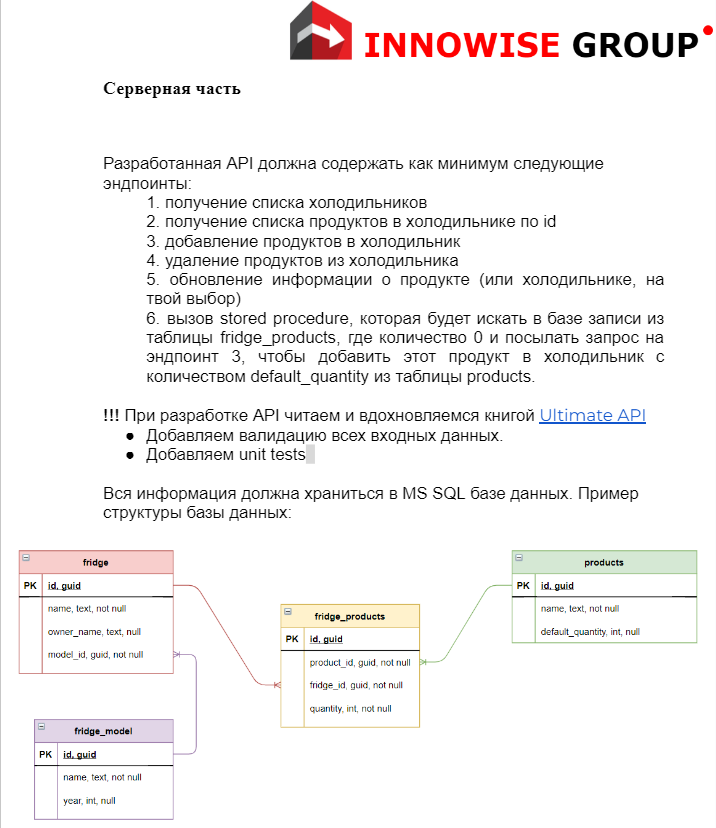
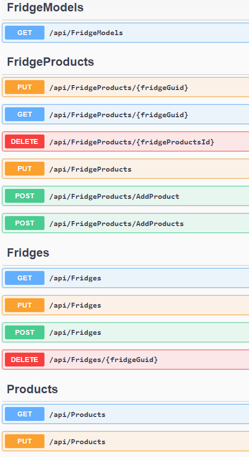

<h1 align="center">Hi there!✌️</a> 
<h3 align="center">This is a WebApi developed during my training on a technical assignment, which allows you to interact with a database that contains 4 linked tables. There is also a 
<a href="https://github.com/MaXiMKnjsh/CLIENT-client-server-app-fridges.git">CLIENT</a>
present to interact with this Api. Used Nuget packages, interfaces such as:</h3> 
<h3> 1)Microsoft.EntityFrameworkCore; 2)Microsoft.EntityFrameworkCore.SqlServer/Tools/InMemory; 3)xUnit; 4)IDisposable. And so on...</h3>
<h2 align="center">🔥Keywords: ASP.Net Core Web Api, Unit-tests, MsSQL, Migrations, .NET Core</h2>
<h2 align="center">The terms of reference:</h2>

